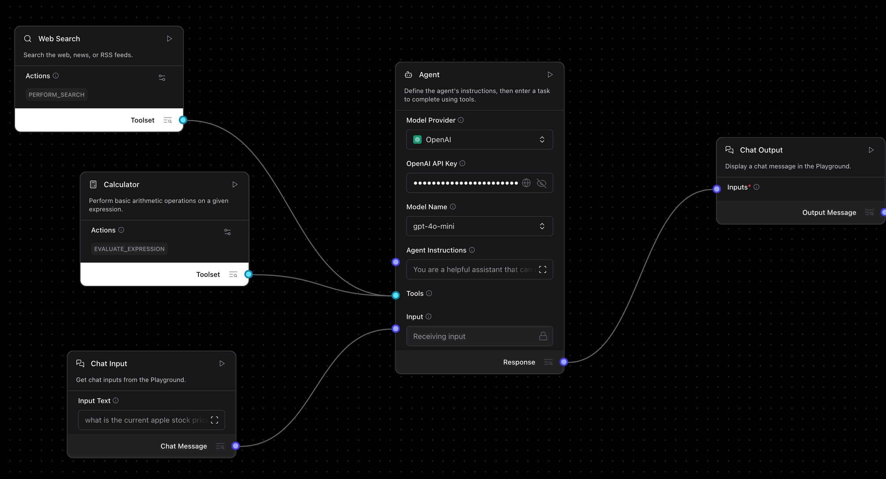

# Langflow Project-Based Learning

Welcome to the **Langflow Project-Based Learning** series! This repository is dedicated to helping you master [Langflow](https://www.langflow.org/) by building practical, real-world AI applications.

## 🚀 About This Repository

This series takes a "learning by doing" approach. Instead of just reading documentation, you will explore and build functional agents and RAG (Retrieval-Augmented Generation) pipelines. Each project is contained within the `All_Flows` directory as a JSON file that can be directly imported into Langflow.

## 📂 Project Directory: All_Flows

The core of this repository is the `All_Flows` folder, which contains the following implementations:

### 1. Simple Agent
**File:** `Simple_Agent.json`
- **Description:** A foundational agent setup. This flow demonstrates the basics of creating an agent in Langflow, connecting a model provider (OpenAI), and setting up the chat interface.
- **Key Concepts:** Agent component, Chat Inputs/Outputs, Model configuration.

### 2. Vector Store RAG
**File:** `Vector Store RAG.json`
- **Description:** A generic Retrieval-Augmented Generation (RAG) pipeline. This flow shows how to ingest data, embed it using a vector store, and retrieve relevant context to answer user queries.
- **Key Concepts:** Vector Stores, Embeddings, RAG architecture, Context retrieval.

### 3. Simple Agent with Web Search & Calculator
**File:** `Simple Agent with Web Search & Calculator Tool.json`
- **Description:** An enhanced agent capable of using tools. This project expands on the simple agent by giving it access to real-time information via web search and mathematical capabilities via a calculator tool.
- **Key Concepts:** Tool calling, Web Search integration, Multi-function agents.


## 🛠️ Getting Started

### Prerequisites
- **Python 3.10+**
- **Langflow** should be installed. If you are using this repo locally, it is managed with [uv](https://github.com/astral-sh/uv).

### Installation

1. **Clone the repository:**
   ```bash
   git clone <repository-url>
   cd langflow-project-based-learning
   ```

2. **Install Dependencies:**
   This project uses `uv` for dependency management.
   ```bash
   uv sync
   ```

3. **Run Langflow:**
   start Langflow to access the UI.
   ```bash
   python -m langflow run
   ```

### How to Use the Flows
1. Open the Langflow UI in your browser (usually at `http://localhost:7860`).
2. Go to the dashboard and upload the JSON files from the `All_Flows` directory.
3. Explore the components and modify them to experiment!

## 🤝 Contributing
Feel free to fork this repository and submit pull requests if you have improvements or new flows to add to the series!